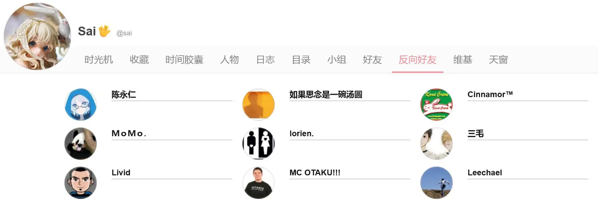

# Bangumi 反向好友导航

在用户页个人导航中增加“反向好友”入口。

## 效果

## 安装

1. 可以通过[这个链接](https://bgm.tv/dev/app/7155)在 Bangumi 组件页面启用。
2. 也可以通过[这个链接](https://raw.githubusercontent.com/imagebuilder1837/bangumi-reverse-friends-nav/refs/heads/main/src/index.user.js)安装到常见的脚本管理器，需要浏览器装有 [Tampermonkey](https://tampermonkey.net/) 或 [Violentmonkey](https://violentmonkey.github.io/) 插件。

## License

本项目基于 MIT License 开源。详见 [LICENSE](LICENSE) 文件。
